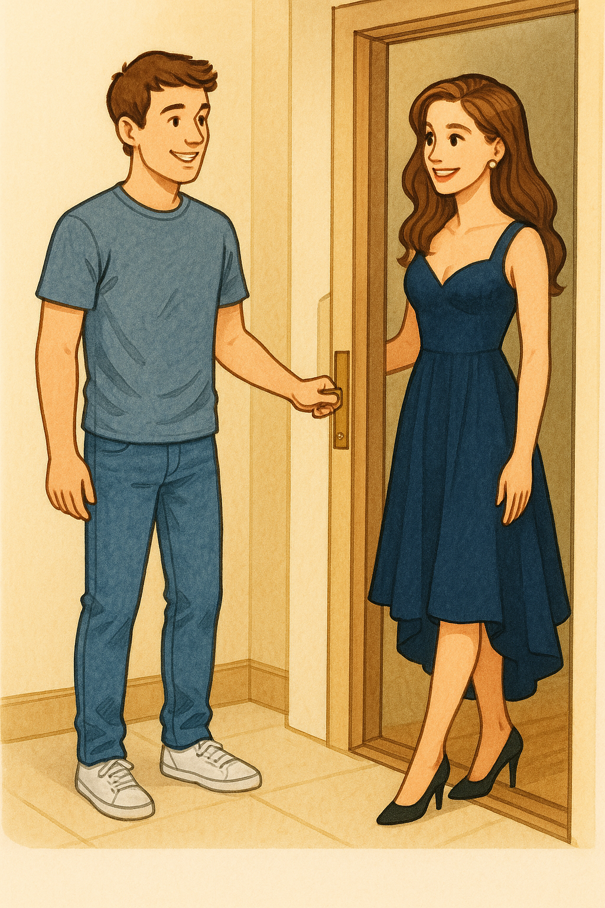
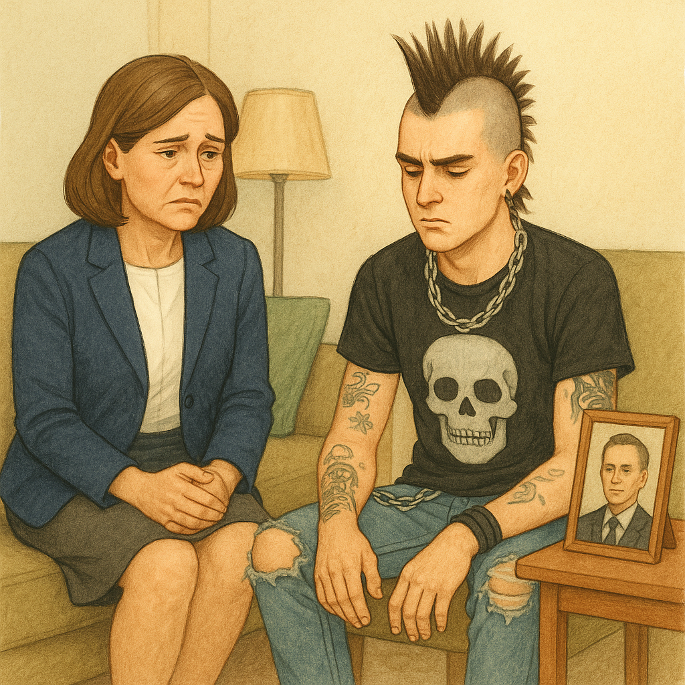
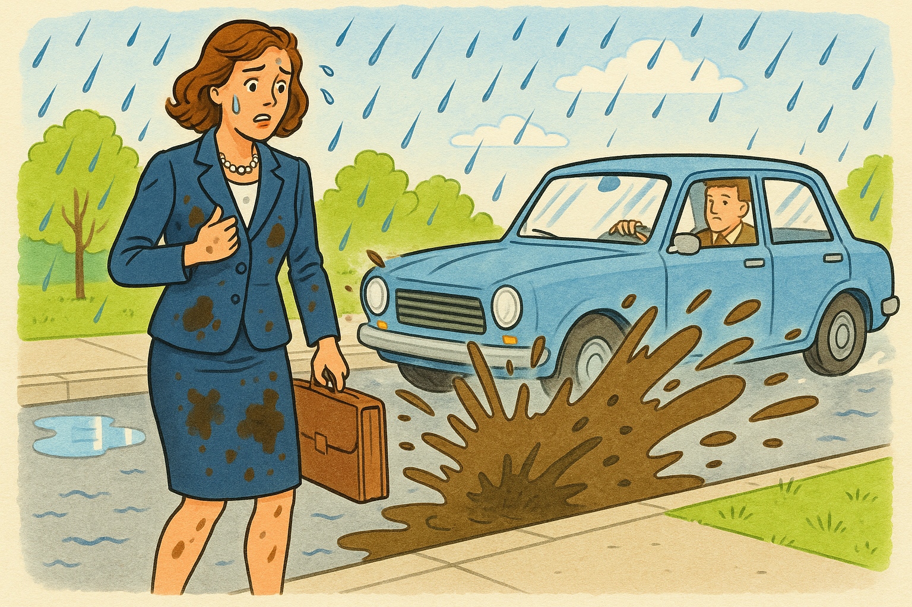

## Yashil sochli yigit

(Kirishi)
Ikki-uch nafar ishga oluvchilar suhbatdan o‘tgan nomzodlarni muhokama qilishyapti. Ular orasida bir yigit bor — juda aqlli va yoqimli, lekin sochi yashil rangda. Shu masala atrofida bahs boshlanadi.

Marcos: Oxirgi talaba menga juda yoqdi.
U aqlli, fe’l-atvori zo‘r, hazilkash ham edi.

Allen: Rostdanmi? Jiddiy gapiryapsanmi? Yashil soch bilan?

Masumi: Uning soch rangi shunchalik muhimmi? Yashil sochli o‘sha yigitmi? Men Marcos bilan roziman. U juda yaxshi edi.

Allen: Ammo uning sochi yashil edi! O‘zini hurmat qilgan hech qanday talaba ish suhbatiga yashil soch bilan kelmaydi!

Masumi: U shunchaki boshqacha. Meningcha, u juda dadil yigit.

Allen: Boshqacha? Albatta boshqacha! U hatto sabzavotga o‘xshardi. Mijozlar bilan gaplashayotganini tasavvur qila olasanmi? Yashil soch bilan? Hech qachon!

Marcos: Agar seni shunchalik bezovta qilsa, uni ishga olganimizdan keyin soch rangini o‘zgartirishini aytsak bo‘ladi-ku.

Masumi: Men bunaqa fikrga qo‘shilmayman, Marcos. Soch rangi — odamning muhim bir qismi. Uni soch rangini majburan o‘zgartirishga undab bo‘lmaydi.

Allen: Unday bo‘lsa, uni olmaylik. Men uni olishga qat’iyan qarshiman.

Marcos: Ammo agar biz uni ishga olmasak, juda yaxshi odamni qo‘ldan boy beramiz deb o‘ylayman.

---

NIMA DEYSAN?

Ken: Ish suhbatiga noodatiy kiyimda borish — normal hol.

Mika: O‘ziga o‘xshamagancha ko‘rinadigan odamlar g‘alati.

Susan: Do‘stlaringga o‘xshab kiyinish — yaxshi fikr.

Luis: Boshqalardan farq qiladigan odamlar doimo muammo chiqaradi.

---

### Muhokama

Ba’zi odamlar o‘z shaxsiyatini ko‘rsatish uchun turli xil uslub va kiyinishlarga harakat qilishadi.
Lekin ba’zan bu boshqalar tomonidan qabul qilinmasligi ham mumkin.
Siz uchun nimalar qabul qilinsa bo‘ladi, nimalar bo‘lmaydi? O‘zingizdan bir fikr ham qo‘shing!

### Jadval: Qanday yondashasiz?

| Mavzu | Men buni qilardim | Yaxshi, lekin men o‘zim buni qilmasdim. | Yo‘q, buni qilmasdim. Bu tentaklik! |
| --- | --- | --- | --- |
| sochimni boshqa rangga bo‘yash | [ ] | [ ] | [ ] |
| qo‘limga tatuirovka yaptirish | [ ] | [ ] | [ ] |
| mo‘hikancha soch turmagini qilish | [ ] | [ ] | [ ] |
| tilimni teshdirish | [ ] | [ ] | [ ] |
| burnimni teshdirish | [ ] | [ ] | [ ] |
| yirtiq jinsilar kiyish | [ ] | [ ] | [ ] |
| rangli kontakt linzalar taqish | [ ] | [ ] | [ ] |
| boshimni butunlay qirdirib tashlash | [ ] | [ ] | [ ] |

---

### MAVZUNI O‘YLAB KO‘RING

1. Rasmdagi odamlar nega xafa yoki ranjigandek ko‘rinadi?
2. Hech qachon rasmlardagi odamlarning holatini o‘zingizda sezganmisiz? Nima bo‘lgan edi?

---

### KIYIM HAQIDA FIKRLAR

#### Qaysi jihatlar eng muhim?

Kiyim xarid qilganda siz uchun eng muhim bo‘lgan jihatlar qaysilar?
Quyidagi bandlarni 1–6 gacha baholang (1 — eng muhim):

| Jihat | Baholash (1–6) |
| --- | --- |
| rang |  |
| uslub (stil) |  |
| qulaylik |  |
| narx |  |
| sizga qanday yarashishi |  |
| brend / dizayner yorlig‘i |  |

#### Bu kiyimlarni kiyarmidingiz? Qayerda yoki qanday vaziyatda?

| Kiyim turi | Kiymoqchimisiz? | Qayerda/vaziyat |
| --- | --- | --- |
| yirtiq kiyimlar | [ ] Ha / [ ] Yo‘q |  |
| eski (ko‘p kiyilgan) kiyimlar | [ ] Ha / [ ] Yo‘q |  |
| kir kiyimlar | [ ] Ha / [ ] Yo‘q |  |
| juda zamonaviy kiyimlar | [ ] Ha / [ ] Yo‘q |  |
| juda yopishqoq (juda tor) kiyimlar | [ ] Ha / [ ] Yo‘q |  |
| juda konservativ (klassik, oddiy) kiyimlar | [ ] Ha / [ ] Yo‘q |  |

---

### Muammolar

#### Muammo 1

Siz maktabga yoki ish suhbatiga kechikayapsiz. Kostyumingizning tugmasi yo‘qligini payqadingiz.
Siz:
a. Tugmani tikasiz, hatto bu sizni yanada kechiktirsa ham.
b. Boshqa kostyumga almashtirasiz, garchi u biroz tor bo‘lsa ham.
c. Tugmasiz holda borasiz.
d. Tugma o‘rniga kulgili belgi (znachok) taqasiz.
e. Boshqa variant:
Sabab:

#### Muammo 2

Siz bir ziyofatdasiz. Kimdir siz bilan aynan bir xil kiyim kiygan.
Siz:
a. O‘sha odamingizdan uzoqlashasiz.
b. Ziyofatdan darhol chiqib ketasiz.
c. “Sizning didingiz zo‘r ekan. Kiyimim sizga ham yoqqaniga xursandman,” deb aytasiz.
d. “Bu kiyimni qayerdan olgansiz? Nechiga olgansiz?” deb so‘raysiz.
e. Boshqa variant:
Sabab:

#### Muammo 3

Siz o‘rta maktab direktorisiz.
Siz:
a. O‘quvchilarga xohlagan kiyimini kiyishga ruxsat berasiz.
b. O‘quvchilarga xohlagan kiyimini kiyishga ruxsat berasiz, lekin tartibli va toza bo‘lishi shart.
c. O‘quvchilarga forma kiyishni majburiy qilasiz.
d. Forma shart emas, ammo maktabda ruxsat etilgan kiyimlar bo‘yicha qat’iy qoidalar joriy qilasiz.
e. Boshqa variant:
Sabab:

---

### Chiroyli ona

Risa 15 yoshda. Onasi esa hozir 40 yoshga kirgan. Risa onasining g‘alati harakat qilayotganini o‘ylaydi. Nima uchun Risa shunday deb o‘ylayapti?

Mari: Risa, hozir onangni ko‘rdim. U kiyimlarini juda zamonaviy qilib kiyibdi. Juda yosh va “zamonaviy” ko‘rinadi.

Risa: Yosh? Zamonaviy? Voy! Juda uyaltiradi! Doim yoshlar kiyadigan kiyimlarni kiyishga urinadi, sizlar bilan musiqalar haqida gaplashadi. Bu meni jinni qilayapti.

Mari: Lekin menimcha, bu yaxshi-ku. Menga onang yoqadi. U juda quvnoq.

Risa: Menga esa yoqmaydi. Uning 40 yoshga kirganidan beri hammasi o‘zgardi. Xuddi bizning yoshimizdagidek yurishga harakat qiladi. Bu noto‘g‘ri. Mening do‘konlarimga borishni xohlaydi, hatto moda jurnallarimni ham “olib turadi”, keyin topolmay qolaman.

Mari: Rostdanmi?

Risa: U sochini oqartirdi, kichkina ko‘ylaklar va kalta yubkalar kiyishni boshladi. Endi esa tatuirovka qilishni o‘ylayapti!

Mari: Haqiqatanmi?!

Risa: Agar shunaqa qilsa, men u bilan ko‘chaga chiqmayman.

Mari: Aslida u sening do‘sting bo‘lishni xohlayotgani yaxshi-ku. Mening onam esa doim: “Qayerga ketyapsan? Qachon qaytasan? Kim bilan borayapsan?” deb so‘raydi. Menimcha, onang sendan maslahat so‘rashi yoki seni xaridga olib borishi juda yaxshi.

Risa: Ha, lekin mening onam juda oshirib yubordi. Dadam ham yordam bermayapti. U onamni “har qachongidan ham chiroyli va jozibali” deb aytadi. “Yaxshi vino kabi, yillar o‘tgani sari yanada mazali bo‘lasan,” deydi. Fu-u-u!

Mari: Fu-u-u!

Risa: Bu juda yoqimsiz!

---

### Uchta fikrni o‘qing.

Uchta fikrni o‘qing.

James:
Risaning onasi muammoga duch kelayotgani ko‘rinadi, Risa uni qo‘llab-quvvatlashga harakat qilishi kerak.

Amber:
Risaga onasining qilayotgan ishlari yoqmaydi, lekin u baribir buni qabul qilishi kerak.

Ray:
Risa onasini ruhlantirishi va u hayotdan zavqlanayotganidan xursand bo‘lishi kerak.

Ko‘makchi gaplarni fikrlar bilan moslang.

Har bir fikrga ikki tadan mos gap bor.

Ko‘makchi gaplar

- Kiyim uslublarini baham ko‘rish — birga vaqt o‘tkazishning yaxshi imkoniyati.
- Ehtimol, onasida ko‘p stress bor. U qo‘llab-quvvatlashga muhtoj.
- Bolalar ota-onalarini hurmat qilishlari kerak.
- Risa onasini shifokorga olib borishi kerak.
- Risa onasi haqida do‘stlari nima deb o‘ylashidan xavotirlanmasligi kerak.
- Risa onasining hayotdan zavqlanayotganidan xursand bo‘lishi kerak.

---

### Muhokama

- Kiygan kiyimlaring kayfiyatingga ta’sir qiladimi?
- Kiyim xarid qilishni yoqtirasanmi? Odatda qayerdan xarid qilasan?
- Kiyimni onlayn olgan yaxshi, yoki do‘kondan olgan yaxshi?
- Kiyim odam haqida birinchi taassurotga qanday ta’sir qiladi?
- Odamlar boshqalarga kiyimi bo‘yicha baho berishadi deb o‘ylaysanmi? Bu adolatlimi?
- Qimmat, mashhur brend kiyimlar haqida fikring qanday?
- Formalar (uniformalar) yaxshi fikr deb o‘ylaysanmi? Nega?
